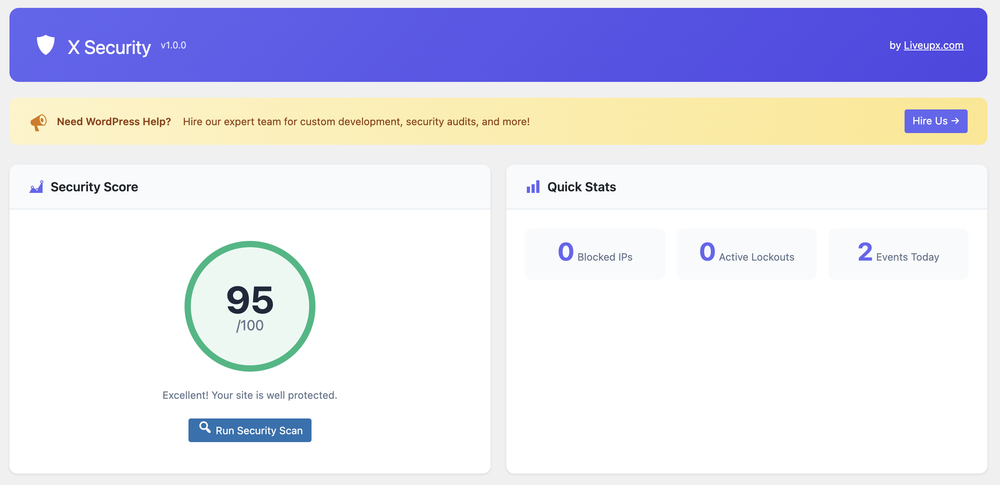
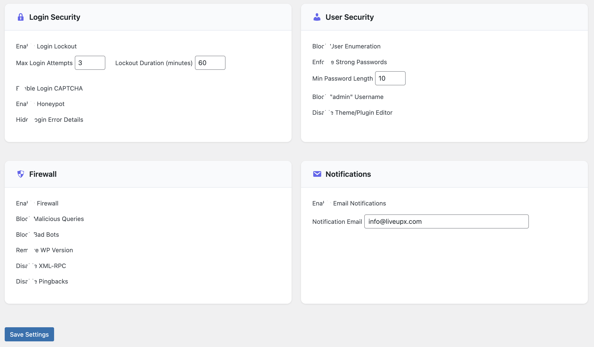
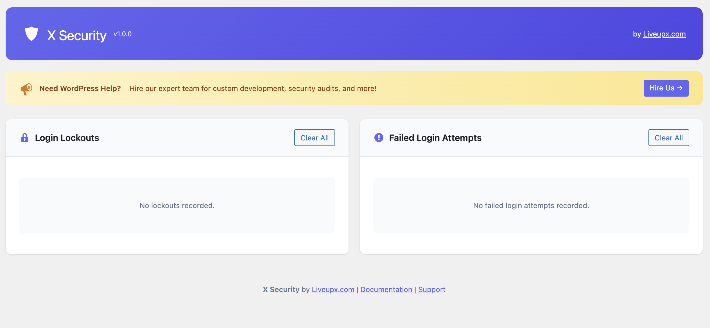
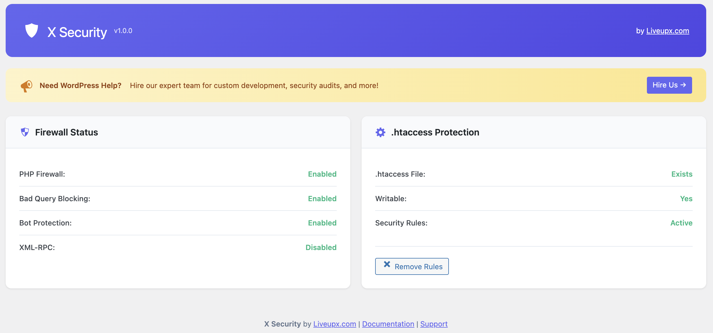
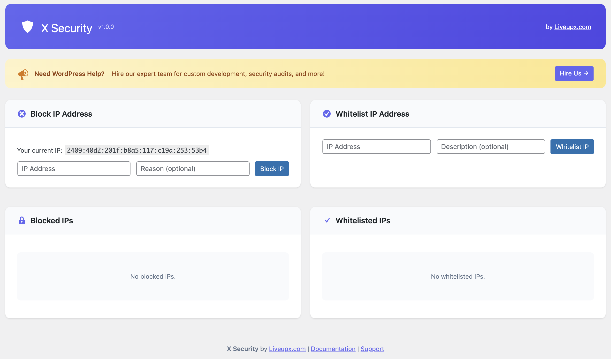
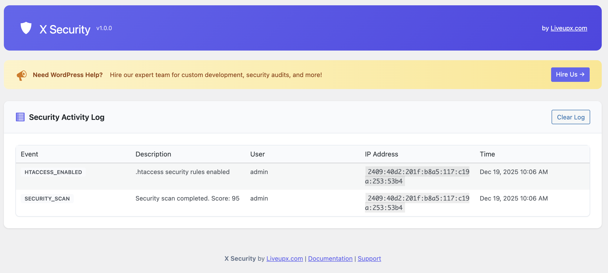

# X Security by Liveupx.com


**X Security** is a comprehensive, lightweight, and completely free WordPress security plugin that protects your website from hackers, brute force attacks, malware, and other security threats. Built with modern PHP practices and WordPress coding standards.

🔒 **Secure** · ⚡ **Lightweight** · 🆓 **100% Free** · 🌐 **Open Source**

---

## 📋 Table of Contents

- [Features](#-features)
- [Requirements](#-requirements)
- [Installation](#-installation)
- [Configuration](#-configuration)
- [Usage Guide](#-usage-guide)
- [Screenshots](#-screenshots)
- [Hooks & Filters](#-hooks--filters)
- [Database Tables](#-database-tables)
- [Contributing](#-contributing)
- [Security](#-security)
- [Changelog](#-changelog)
- [Roadmap](#-roadmap)
- [Support](#-support)
- [License](#-license)
- [Credits](#-credits)

---

## ✨ Features

### 🔐 Login Security
| Feature | Description |
|---------|-------------|
| **Brute Force Protection** | Automatically locks out IP addresses after failed login attempts |
| **Login Lockout** | Configurable lockout duration and attempt limits |
| **Honeypot Field** | Invisible form field that catches automated bots |
| **Math CAPTCHA** | Simple math challenge to prevent bot logins |
| **Hide Login Errors** | Prevents username enumeration via login error messages |

### 🛡️ Firewall Protection
| Feature | Description |
|---------|-------------|
| **Bad Query Blocking** | Blocks SQL injection, XSS, and other malicious requests |
| **Bad Bot Blocking** | Blocks known malicious bots and vulnerability scanners |
| **XML-RPC Protection** | Disable XML-RPC to prevent DDoS and brute force attacks |
| **Pingback Protection** | Disable pingbacks to prevent DDoS amplification |
| **Version Hiding** | Removes WordPress version from source code |

### 👤 User Security
| Feature | Description |
|---------|-------------|
| **User Enumeration Protection** | Prevents discovery of usernames via ?author= scans |
| **REST API Protection** | Disables user endpoints for non-authenticated users |
| **Strong Password Enforcement** | Requires uppercase, lowercase, numbers, and special characters |
| **Minimum Password Length** | Configurable minimum password length requirement |
| **Block "admin" Username** | Prevents registration with common admin usernames |
| **Disable File Editor** | Disables the theme/plugin editor in WordPress admin |

### 🌐 IP Management
| Feature | Description |
|---------|-------------|
| **IP Blocking** | Manually block suspicious IP addresses |
| **IP Whitelisting** | Whitelist trusted IPs to bypass security checks |
| **Automatic Blocking** | IPs are automatically blocked after security violations |

### 📝 Activity Monitoring
| Feature | Description |
|---------|-------------|
| **Activity Log** | Comprehensive logging of all security events |
| **Login Tracking** | Track successful and failed login attempts |
| **Event Types** | Categorized events for easy filtering |
| **Auto Cleanup** | Automatic cleanup of old log entries |

### 🔧 Server-Level Protection
| Feature | Description |
|---------|-------------|
| **.htaccess Rules** | Server-level protection rules for Apache |
| **wp-config.php Protection** | Blocks direct access to configuration file |
| **Directory Browsing** | Disables directory listing |
| **Sensitive File Protection** | Protects .htaccess and other sensitive files |

### 📊 Security Dashboard
| Feature | Description |
|---------|-------------|
| **Security Score** | Visual security score (0-100) based on enabled features |
| **Quick Stats** | At-a-glance view of blocked IPs, lockouts, and events |
| **Security Scan** | One-click security audit with recommendations |
| **Quick Actions** | Common tasks accessible from dashboard |

---

## 📦 Requirements

- **WordPress**: 5.0 or higher
- **PHP**: 7.4 or higher
- **MySQL**: 5.6 or higher / MariaDB 10.0 or higher
- **Web Server**: Apache (for .htaccess features) or Nginx

---

## 🚀 Installation

### Method 1: WordPress Admin (Recommended)

1. Download the latest release from [GitHub Releases](https://github.com/liveupx/x-security-wordpress-security-plugin-free/releases)
2. Go to **WordPress Admin → Plugins → Add New**
3. Click **Upload Plugin**
4. Choose the downloaded `x-security.zip` file
5. Click **Install Now**
6. Click **Activate Plugin**

### Method 2: Manual Installation

1. Download and unzip the plugin
2. Upload the `x-security` folder to `/wp-content/plugins/`
3. Activate the plugin through the **Plugins** menu in WordPress

### Method 3: Composer

```bash
composer require liveupx/x-security
```

### Method 4: WP-CLI

```bash
wp plugin install x-security --activate
```

---

## ⚙️ Configuration

After activation, navigate to **X Security** in your WordPress admin sidebar.

### Initial Setup

1. Go to **X Security → Settings**
2. Configure each security module according to your needs
3. Save your settings
4. Optionally enable .htaccess protection under **X Security → Firewall**

### Recommended Settings

For most websites, we recommend enabling:

```
✅ Login Lockout (3 attempts, 60 min lockout)
✅ Honeypot Field
✅ Hide Login Errors
✅ User Enumeration Protection
✅ Strong Passwords (12+ characters)
✅ Disable File Editor
✅ Firewall
✅ Block Bad Queries
✅ Block Bad Bots
✅ Disable XML-RPC
✅ Remove WP Version
✅ Email Notifications
```

---

## 📖 Usage Guide

### Dashboard

The dashboard provides an overview of your site's security status:

- **Security Score**: A score from 0-100 based on enabled security features
- **Quick Stats**: Number of blocked IPs, active lockouts, and today's events
- **Recent Activity**: Latest security events logged by the plugin
- **Quick Actions**: Common tasks like clearing lockouts and running scans

### Running a Security Scan

1. Go to **X Security → Dashboard**
2. Click the **Run Security Scan** button
3. Review the results showing passed checks, issues, and warnings
4. Address any issues by enabling the recommended features

### Managing Blocked IPs

1. Go to **X Security → IP Manager**
2. View currently blocked IPs
3. To manually block an IP:
   - Enter the IP address
   - Optionally add a reason
   - Click **Block IP**
4. To unblock an IP, click the **Unblock** button next to it

### Whitelisting IPs

Whitelisted IPs bypass all security checks:

1. Go to **X Security → IP Manager**
2. Enter the IP address to whitelist
3. Add a description (e.g., "Office IP")
4. Click **Whitelist IP**

⚠️ **Warning**: Only whitelist IPs you fully trust.

### Enabling .htaccess Protection

1. Go to **X Security → Firewall**
2. Check that your .htaccess file is writable
3. Click **Enable .htaccess Protection**
4. The plugin will add security rules to your .htaccess file

### Viewing Activity Logs

1. Go to **X Security → Activity Log**
2. View all security events with timestamps
3. Use pagination to browse older entries
4. Click **Clear Log** to remove all entries

---

## 📸 Screenshots

### Dashboard


### Security


### Login Security


### Firewall & .htaccess Manager


### IP Manager


### Security Activity Log


---

## 🔗 Hooks & Filters

X Security provides hooks for developers to extend functionality:

### Actions

```php
// Fired when an IP is blocked
do_action('xsec_ip_blocked', $ip_address, $reason);

// Fired when an IP is unblocked
do_action('xsec_ip_unblocked', $ip_address);

// Fired when a login lockout is created
do_action('xsec_lockout_created', $ip_address, $username, $duration);

// Fired when a security event is logged
do_action('xsec_event_logged', $event_type, $description, $ip_address);

// Fired after security scan completes
do_action('xsec_scan_completed', $results);
```

### Filters

```php
// Modify the list of bad bot user agents
add_filter('xsec_bad_bots', function($bots) {
    $bots[] = 'CustomBadBot';
    return $bots;
});

// Modify bad query patterns
add_filter('xsec_bad_queries', function($patterns) {
    $patterns[] = 'malicious_pattern';
    return $patterns;
});

// Modify the security score calculation
add_filter('xsec_security_score', function($score) {
    // Add custom scoring logic
    return $score;
});

// Modify lockout duration
add_filter('xsec_lockout_duration', function($duration, $ip, $username) {
    // Increase lockout for repeat offenders
    return $duration;
}, 10, 3);

// Customize the blocked page message
add_filter('xsec_blocked_message', function($message) {
    return 'Custom blocked message';
});

// Whitelist additional IPs programmatically
add_filter('xsec_whitelisted_ips', function($ips) {
    $ips[] = '192.168.1.100';
    return $ips;
});
```

---

## 🗄️ Database Tables

X Security creates the following database tables:

| Table | Purpose |
|-------|---------|
| `{prefix}_xsec_login_lockouts` | Stores active and historical login lockouts |
| `{prefix}_xsec_failed_logins` | Records failed login attempts |
| `{prefix}_xsec_activity_log` | Comprehensive security event log |
| `{prefix}_xsec_blocked_ips` | Manually and automatically blocked IPs |
| `{prefix}_xsec_whitelist_ips` | Whitelisted IP addresses |

### Table Schemas

```sql
-- Login Lockouts
CREATE TABLE {prefix}_xsec_login_lockouts (
    id bigint(20) NOT NULL AUTO_INCREMENT,
    ip_address varchar(100) NOT NULL,
    username varchar(255) NOT NULL,
    lockout_time datetime NOT NULL,
    release_time datetime NOT NULL,
    reason varchar(255) DEFAULT '',
    PRIMARY KEY (id)
);

-- Activity Log
CREATE TABLE {prefix}_xsec_activity_log (
    id bigint(20) NOT NULL AUTO_INCREMENT,
    user_id bigint(20) DEFAULT 0,
    username varchar(255) DEFAULT '',
    ip_address varchar(100) NOT NULL,
    event_type varchar(100) NOT NULL,
    event_description text NOT NULL,
    event_data longtext,
    event_time datetime NOT NULL,
    PRIMARY KEY (id)
);
```

---

## 🤝 Contributing

We welcome contributions from the community! Here's how you can help:

### Ways to Contribute

- 🐛 **Report Bugs**: Open an issue with detailed reproduction steps
- 💡 **Suggest Features**: Open an issue with your feature request
- 📖 **Improve Documentation**: Submit PRs for documentation improvements
- 💻 **Submit Code**: Fork, code, and submit a pull request
- 🌍 **Translate**: Help translate the plugin to other languages
- ⭐ **Star the Repo**: Show your support by starring the repository

### Development Setup

1. Clone the repository:
   ```bash
   git clone https://github.com/liveupx/x-security-wordpress-security-plugin-free.git
   ```

2. Set up a local WordPress development environment

3. Symlink or copy the plugin to your `wp-content/plugins` directory

4. Activate the plugin and start developing

### Coding Standards

- Follow [WordPress Coding Standards](https://developer.wordpress.org/coding-standards/wordpress-coding-standards/)
- Use meaningful commit messages
- Add PHPDoc comments to all functions
- Write unit tests for new features
- Ensure PHP 7.4+ compatibility

### Pull Request Process

1. Fork the repository
2. Create a feature branch (`git checkout -b feature/amazing-feature`)
3. Make your changes
4. Run tests and ensure coding standards compliance
5. Commit your changes (`git commit -m 'Add amazing feature'`)
6. Push to your branch (`git push origin feature/amazing-feature`)
7. Open a Pull Request

---

## 🔒 Security

### Reporting Vulnerabilities

If you discover a security vulnerability, please report it responsibly:

1. **DO NOT** open a public issue
2. Email security concerns to: **security@liveupx.com**
3. Include detailed steps to reproduce
4. Allow up to 48 hours for initial response

We take security seriously and will address valid reports promptly.

### Security Best Practices

In addition to using X Security, we recommend:

- Keep WordPress, themes, and plugins updated
- Use strong, unique passwords
- Enable two-factor authentication (coming soon to X Security)
- Use HTTPS/SSL on your site
- Regular backups
- Choose a reputable hosting provider

---

## 📝 Changelog

### Version 1.5.0 (2024-12-19)
**Full PHPCS Compliance**

- 🔧 Fixed all remaining WordPress Plugin Check warnings
- 🔧 Improved SQL query handling with proper phpcs directives
- 🔧 Enhanced array input sanitization using `map_deep()`
- 🔧 Full WordPress coding standards compliance
- 🔧 Ready for WordPress.org submission

### Version 1.4.0 (2024-12-19)
**Compatibility & Security**

- 🔧 Fixed compatibility with WordPress 5.0+ (removed %i placeholder)
- 🔧 Improved input sanitization for settings array
- 🔧 Enhanced security validation

### Version 1.3.0 (2024-12-19)
**Bug Fixes & Improvements**

- 🔧 Fixed WordPress Playground compatibility
- 🔧 Fixed all WordPress Plugin Check errors
- 🔧 Uses WP_Filesystem for file operations
- 🔧 Improved code quality and PHPCS compliance
- 🔧 Added proper translators comments for i18n
- 🔧 Enhanced database query security
- 🔧 Properly escaped all output
- 🔧 Added phpcs ignore comments with justifications

### Version 1.0.0 (2024-12-19)
**Initial Release**

- ✅ Login lockout protection
- ✅ Brute force prevention
- ✅ Honeypot field for login form
- ✅ Math CAPTCHA option
- ✅ Hide login error details
- ✅ User enumeration protection
- ✅ REST API user endpoint protection
- ✅ Strong password enforcement
- ✅ Block "admin" username
- ✅ Disable file editor
- ✅ PHP-based firewall
- ✅ Bad query blocking (SQLi, XSS)
- ✅ Bad bot blocking
- ✅ XML-RPC disable option
- ✅ Pingback disable option
- ✅ WordPress version hiding
- ✅ IP blocking and unblocking
- ✅ IP whitelisting
- ✅ Activity logging
- ✅ Security dashboard with score
- ✅ Security scan feature
- ✅ .htaccess protection rules
- ✅ Email notifications
- ✅ Auto-cleanup of old data

---

## 🗺️ Roadmap

Planned features for future releases:

### Version 1.6.0
- [ ] Two-Factor Authentication (TOTP)
- [ ] Login page reCAPTCHA integration
- [ ] Custom login URL
- [ ] Force logout all users

### Version 1.7.0
- [ ] File change detection
- [ ] Malware scanning
- [ ] Database backup
- [ ] Database prefix changer

### Version 1.8.0
- [ ] Country blocking
- [ ] Rate limiting
- [ ] Comment spam protection
- [ ] WooCommerce integration

### Version 2.0.0
- [ ] Multisite support
- [ ] REST API for external monitoring
- [ ] Security headers management
- [ ] Import/Export settings

Want to vote on features? [Open a discussion](https://github.com/liveupx/x-security-wordpress-security-plugin-free/discussions)!

---

## 💬 Support

### Free Support

- 📖 [Documentation](https://liveupx.com/docs/x-security)
- 💬 [GitHub Discussions](https://github.com/liveupx/x-security-wordpress-security-plugin-free/discussions)
- 🐛 [Issue Tracker](https://github.com/liveupx/x-security-wordpress-security-plugin-free/issues)
- 📧 Email: support@liveupx.com

### Premium Support

Need priority support or custom development? Contact us at [liveupx.com/contact](https://liveupx.com/contact)

### Frequently Asked Questions

<details>
<summary><strong>Will this plugin slow down my site?</strong></summary>

No. X Security is designed to be lightweight. Security checks are optimized and only run when necessary. The plugin adds minimal overhead to your site.
</details>

<details>
<summary><strong>Is this plugin compatible with caching plugins?</strong></summary>

Yes. X Security works with all major caching plugins including WP Rocket, W3 Total Cache, LiteSpeed Cache, and others.
</details>

<details>
<summary><strong>What happens if I lock myself out?</strong></summary>

You can regain access by:
1. Waiting for the lockout to expire
2. Accessing your database and clearing the `xsec_login_lockouts` table
3. Renaming the plugin folder via FTP to deactivate it
</details>

<details>
<summary><strong>Does this work with Nginx?</strong></summary>

Yes, all PHP-based features work with Nginx. However, .htaccess rules only work with Apache. For Nginx, you'll need to manually add security rules to your server configuration.
</details>

<details>
<summary><strong>Can I use this with other security plugins?</strong></summary>

We recommend using only one security plugin to avoid conflicts. X Security provides comprehensive protection on its own.
</details>

---

## 📄 License

X Security is free software released under the [GNU General Public License v2](https://www.gnu.org/licenses/gpl-2.0.html) or later.

```
Copyright (C) 2024 Liveupx.com

This program is free software; you can redistribute it and/or modify
it under the terms of the GNU General Public License as published by
the Free Software Foundation; either version 2 of the License, or
(at your option) any later version.

This program is distributed in the hope that it will be useful,
but WITHOUT ANY WARRANTY; without even the implied warranty of
MERCHANTABILITY or FITNESS FOR A PARTICULAR PURPOSE. See the
GNU General Public License for more details.
```

---

## 👏 Credits

### Developed By

**[Liveupx.com](https://liveupx.com)** - WordPress Development & Security Experts

### Contributors

Thanks to all contributors who help make X Security better!

<!-- ALL-CONTRIBUTORS-LIST:START -->
<!-- Add contributor avatars here -->
<!-- ALL-CONTRIBUTORS-LIST:END -->

### Special Thanks

- The WordPress community
- All users who report bugs and suggest features
- Open source security researchers

---

## 🌟 Show Your Support

If X Security helps protect your website:

- ⭐ **Star this repository**
- 🐦 **Share on Twitter/X**
- 📝 **Write a review** on WordPress.org
- 💬 **Recommend to others**

---

<p align="center">
  <strong>Made with ❤️ by <a href="https://liveupx.com">Liveupx.com</a></strong>
  <br><br>
  <a href="https://liveupx.com">Website</a> •
  <a href="https://twitter.com/liveupx">Twitter</a> •
  <a href="https://github.com/liveupx">GitHub</a>
</p>
